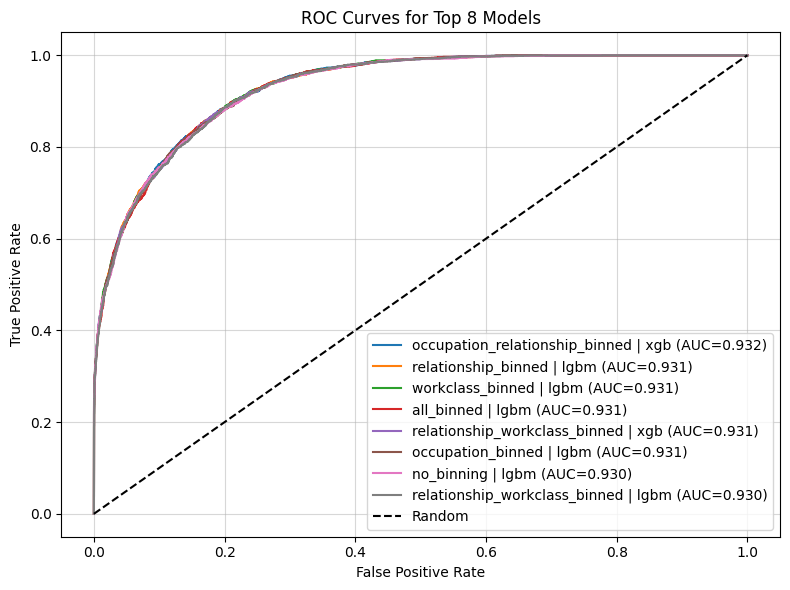
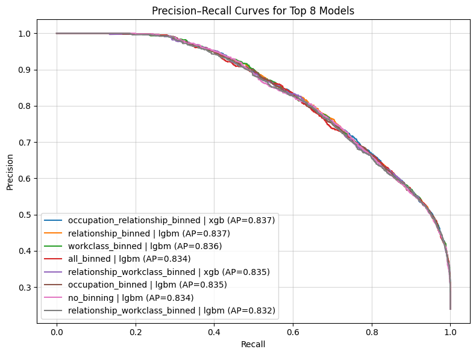
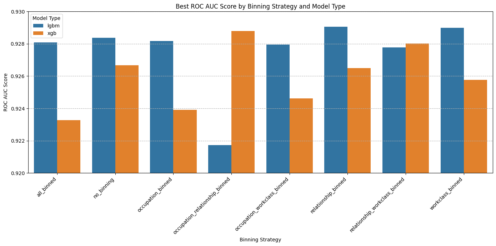

# Adult Census Income Prediction  
**Springboard Data Science Capstone Two**

## Overview
This project builds and evaluates machine learning models to predict whether an individual earns **more than $50,000 per year** using the UCI Adult Census Income dataset. The repository is structured for **end-to-end reproducibility**, with each intermediate artifact generated explicitly by executing the notebooks in order.

---

## 🔍 TL;DR for Recruiters
- **Problem:** Binary income classification (> $50K) using U.S. Census data  
- **Models:** XGBoost and LightGBM  
- **Methodology:** 8 preprocessing strategies + Bayesian hyperparameter tuning (Optuna)  
- **Rigor:** Fully reproducible pipeline with explicit data lineage  
- **Outcome:** Strong ROC AUC performance with sensitivity to preprocessing choices  

---

## Key Deliverables
- **Final report:** `Final_Report.pdf`  
- **Executive slide deck:** `Executive_Slide_Deck.pptx`  
- **Reproducible model metrics:** `final_model_metrics_full.csv`

---

## Data Lineage (What Creates What)
This project follows a strict, linear pipeline. All derived files are generated by running the notebooks below.

### 1. Raw Data → Cleaned Dataset
- **Notebook:** `01_Data_Wrangling.ipynb`  
- **Inputs:**  
  - `raw_data/adult.data`  
  - `raw_data/adult.test`  
- **Output:**  
  - `adult_combined_cleaned.csv`

---

### 2. Cleaned Dataset → Encoded Feature Sets
- **Notebook:** `02_EDA.ipynb`  
- **Input:**  
  - `adult_combined_cleaned.csv`  
- **Outputs:**  
  - `df_encoded_part1.csv`  
  - `df_encoded_part2.csv`

---

### 3. Encoded Features → Train/Test Datasets
- **Notebook:** `03_Preprocessing_and_Train_Test_Build.ipynb`  
- **Inputs:**  
  - `df_encoded_part1.csv`  
  - `df_encoded_part2.csv`  
- **Output directory:**  
  - `Binned_Test_Train_Data/`  
- Contains multiple binned and non-binned train/test splits used for systematic comparison.

---

### 4. Modeling & Evaluation
- **Notebook:** `04_Modelling.ipynb`  
- **Inputs:**  
  - Files from `Binned_Test_Train_Data/`  
- **Outputs:**  
  - `final_model_metrics_full.csv` (written directly by the notebook)  
  - Figures saved to `figures/`

---

## Modeling Approach
- **Models evaluated:**
  - XGBoost
  - LightGBM
- **Hyperparameter tuning:**  
  - Optuna (Bayesian optimization)
- **Evaluation metrics:**
  - ROC AUC
  - Accuracy
  - Precision
  - Recall
  - F1 Score
  - Log Loss
  - Average Precision
- **Design:**  
  - Eight preprocessing / binning configurations evaluated consistently across models.

---

## Results Highlights

### ROC Curves for Top Models


### Precision–Recall Curves for Top Models


### Best ROC AUC by Binning Strategy and Model Type


---

## Repository Structure
```text
.
├── 01_Data_Wrangling.ipynb
├── 02_EDA.ipynb
├── 03_Preprocessing_and_Train_Test_Build.ipynb
├── 04_Modelling.ipynb
│
├── adult_combined_cleaned.csv
├── df_encoded_part1.csv
├── df_encoded_part2.csv
├── final_model_metrics_full.csv
│
├── Binned_Test_Train_Data/
│   ├── X_train_*.csv
│   ├── X_test_*.csv
│   ├── y_train.csv
│   └── y_test.csv
│
├── raw_data/
│   ├── adult.data
│   ├── adult.test
│   ├── adult.names
│   └── old.adult.names
│
├── figures/
│   ├── roc_curves_top8.png
│   ├── pr_curves_top8.png
│   ├── best_auc_by_strategy.png
│   └── roc_auc_distribution.png
│
├── Adult_Census_Income_Project_Proposal.pdf
├── Final_Report.pdf
├── Executive_Slide_Deck.pptx
├── requirements.txt
└── README.md
```

---

## How to Reproduce All Results
1. Install dependencies:
   ```bash
   pip install -r requirements.txt
   ```

2. Run notebooks **in order**:
   1. `01_Data_Wrangling.ipynb`
   2. `02_EDA.ipynb`
   3. `03_Preprocessing_and_Train_Test_Build.ipynb`
   4. `04_Modelling.ipynb`

Executing the full sequence will regenerate **all intermediate CSV files** and reproduce `final_model_metrics_full.csv`.

---

## Author
**Nicholas Butler**  
Springboard Data Science Career Track
